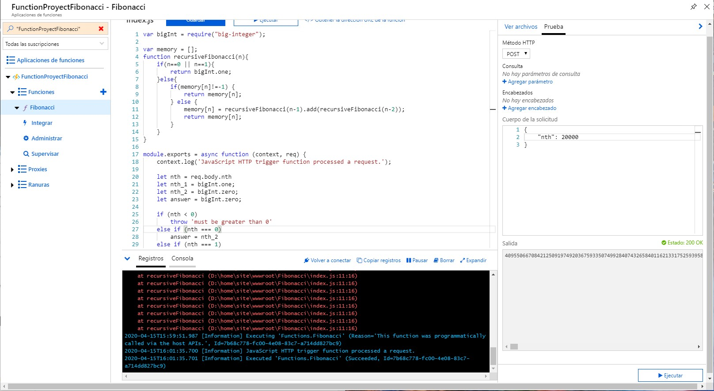
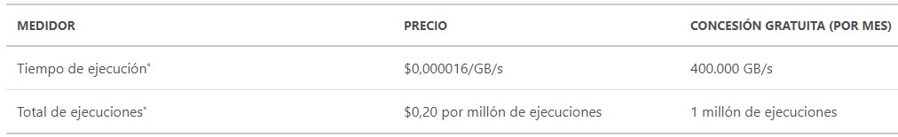
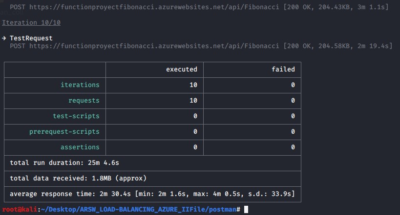
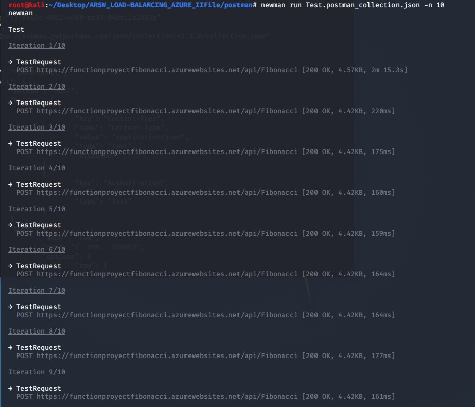
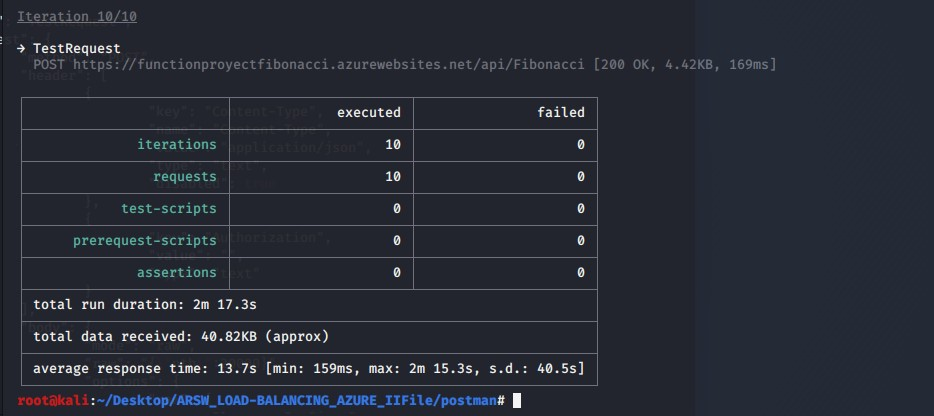

### Escuela Colombiana de Ingeniería
### Arquitecturas de Software - ARSW

## Escalamiento en Azure con Maquinas Virtuales, Sacale Sets y Service Plans

### Dependencias
* Cree una cuenta gratuita dentro de Azure. Para hacerlo puede guiarse de esta [documentación](https://azure.microsoft.com/en-us/free/search/?&ef_id=Cj0KCQiA2ITuBRDkARIsAMK9Q7MuvuTqIfK15LWfaM7bLL_QsBbC5XhJJezUbcfx-qAnfPjH568chTMaAkAsEALw_wcB:G:s&OCID=AID2000068_SEM_alOkB9ZE&MarinID=alOkB9ZE_368060503322_%2Bazure_b_c__79187603991_kwd-23159435208&lnkd=Google_Azure_Brand&dclid=CjgKEAiA2ITuBRDchty8lqPlzS4SJAC3x4k1mAxU7XNhWdOSESfffUnMNjLWcAIuikQnj3C4U8xRG_D_BwE). Al hacerlo usted contará con $200 USD para gastar durante 1 mes.

### Parte 0 - Entendiendo el escenario de calidad

Adjunto a este laboratorio usted podrá encontrar una aplicación totalmente desarrollada que tiene como objetivo calcular el enésimo valor de la secuencia de Fibonnaci.

**Escalabilidad**
Cuando un conjunto de usuarios consulta un enésimo número (superior a 1000000) de la secuencia de Fibonacci de forma concurrente y el sistema se encuentra bajo condiciones normales de operación, todas las peticiones deben ser respondidas y el consumo de CPU del sistema no puede superar el 70%.

### Escalabilidad Serverless (Functions)

1. Cree una Function App tal cual como se muestra en las  imagenes.


2. Instale la extensión de **Azure Functions** para Visual Studio Code.


3. Despliegue la Function de Fibonacci a Azure usando Visual Studio Code. La primera vez que lo haga se le va a pedir autenticarse, siga las instrucciones.


4. Dirijase al portal de Azure y pruebe la function.


5. Modifique la coleción de POSTMAN con NEWMAN de tal forma que pueda enviar 10 peticiones concurrentes. Verifique los resultados y presente un informe.

 Para poder ejecutar utilizamos el comando
 ```
 newman run Test.postman_collection.json -n 10
 ```
 
6. Cree una nueva Function que resuleva el problema de Fibonacci pero esta vez utilice un enfoque recursivo con memoization. Pruebe la función varias veces, después no haga nada por al menos 5 minutos. Pruebe la función de nuevo con los valores anteriores. ¿Cuál es el comportamiento?.



La memorización no funciona, es decir, la lista está limpia de nuevo. Después de 5 minutos de inactividad, los tiempos vuelven a ser como si no se hubiesen hecho consultas previas.


**Preguntas**

* ¿Qué es un Azure Function?

```
 Permite desarrollar con más eficacia una plataforma informática sin servidor basada en eventos, permite compilar y depurar a nivel local sin configuracines edicionales.

```

* ¿Qué es serverless?

```
Se refiere al modelo de computación en el que el proveedor permite ejecutar durante un periodo de tiempo, porciones de código denominadas funciones sin necesidad de hacernos cargo de su infraestructura. Se encarga de escalar y liberar recursos automaticamente cuando sea necesario.
```

* ¿Qué es el runtime y que implica seleccionarlo al momento de crear el Function App?

```
Se relaciona principalmente con la version de .NET en la que se basa su tiempo de ejecución. Al seleccionar el plan Consumption y la versión de runtime 2, implica que  su "timeout duration" es de 5 minutos.
```

* ¿Por qué es necesario crear un Storage Account de la mano de un Function App?

```
Porque proporciona un espacio de nombres único para los datos de Azure Storage que es accesible a través de HTTP.
```

* ¿Cuáles son los tipos de planes para un Function App?, ¿En qué se diferencias?, mencione ventajas y desventajas de cada uno de ellos.

```
Existen 3 tipos de planes: Consumption, Premium y App Service. Sus características, ventajas y desventajas de pueden ver en la siguiente imagen:
```


* ¿Por qué la memoization falla o no funciona de forma correcta?

```
Después de los 5 minutos, functionTimeout llega al límite de espera y la siguiente petición que se haga es como si fuera la primera, es decir, la estructura de memorización usada anteriormente queda vacía.
```

* ¿Cómo funciona el sistema de facturación de las Function App?

```
Se factura en función del consumo de recursos y las ejecuciones por segundo así:
```



* Informe

```
Prueba de carga sin memorización:
```



```
Gracias a los resultados de tiempo de cada una de las peticiones, se observa que sin memorización los tiempos de cada una de ellas es similar, no se utilizan resultados anteriores sino que se hace desde el inicio. Las consultas previas no se almacenan en un estructura de datos, en donde su búsqueda representaría un tiempo lineal.

Para la prueba de carga con memorización se observa un tiempo de 2m y 15s para la primera consulta, y un tiempo mucho menor de 160ms para las siguientes 9, ya que se hace uso de la estructura de datos destinada para memorizar que hace que dichas 9 consultas sean lineales:
```






